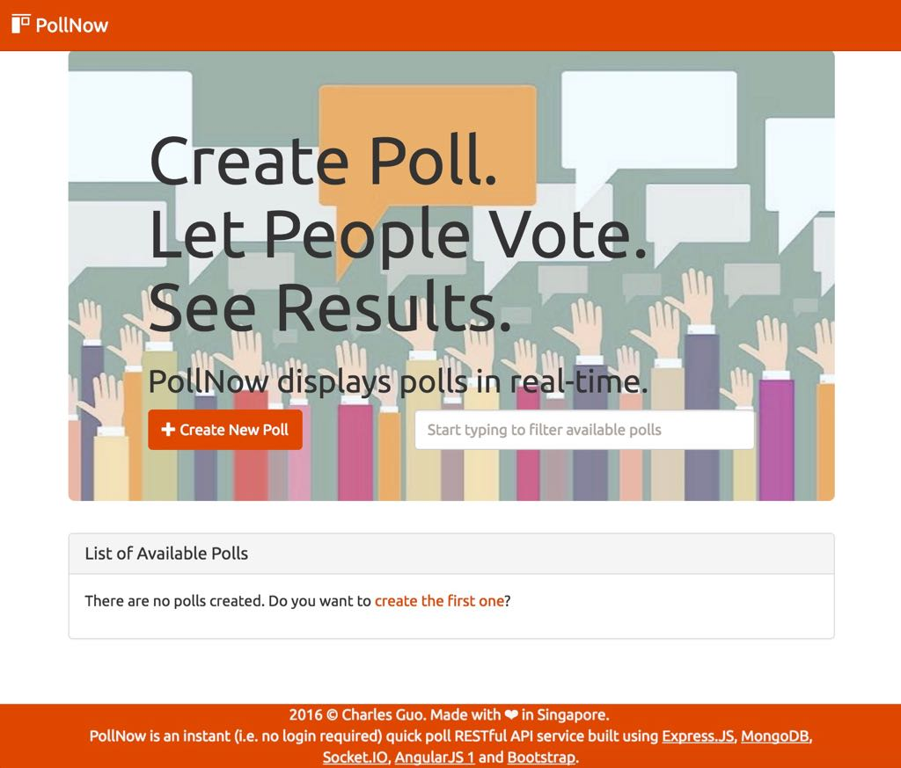

# PollNow: A Quick Way to Create Polls, Get Users to Vote and See Results

## Overview

[PollNow](https://pollnow.herokuapp.com) allows users to quickly create polls, get users to vote, and see the results of each poll.

### Requirements For Each Poll:
* Each question consists of a question with a minimum of 2 possible responses.
* The Poll Creator is able to increase the number of possible responses.
* The Poll Voter must select ONE of the possible responses in order to vote.

### Key Features of PollNow:
* (* The current implemented solution needs to be further improved.) PollNow is designed to allow voters to vote without actually requiring to sign in. PollNow detects whether a user has actually voted by storing the user's socket.request.connection.remoteAddress (or req.ip) value, which is either (in a IPv6 format) :::1 for a local development environment or an internally-reserved address such as ::ffff:10.238.23.36 in a production environment.

#### Why are we doing this?
Most of the time, users will be seen to have the same IP address i.e. that of the router's. If you have multiple computers connected to the network, you can check this by typing "What is my ip" in a Google Search Box. As such, the 'x-forwarded-for' property in socket.handshake.headers or req.headers cannot distinguish between such users.

However the issue with using the socket.request.connection.remoteAddress (or req.ip) property is that it changes every couple of minutes or so (depending on the router's setting). As such, it is not a foolproof way of distinguishing users.

Without requiring the user to authenticate before voting, a voter intent on "gaming" the system can always open another browser tab, use another browser, or use another device. However, the current implementation can still be improved by either associating a vote with:
i) the user's socket.id OR
ii) data stored in a JWT token stored in the user's browser.

Perhaps there is no escaping the usefulness of authentication in preventing users from repeatedly voting in the same poll.

#### Issues with the current MVP

1) Once the user's remoteAddress has changed, it is possible for the user to re-vote a survey.
2) When that happens (in the Heroku production environment) where multiple users are concurrently using the app, it is possible for the user to continue voting again. Have not been able to diagnose the issue as it does not occur in the local development environment. (Am suspecting it is due to how Heroku implements multiple socket requests with multiple users.)

### Technology Stack

1. Express.JS
1. MongoDB (and mongoose)
1. Socket.IO
1. Angular.JS (i.e. v1)
1. Bootstrap

### File Structure

*  app.js (start the app by nodemon app.js)
  * models
    * Poll.js - contains the schemas for PollScheme, ChoiceSchema and voteSchema
  * public
    * images - contains the jumbotron image and images used in this README
    * javascripts
      * app.js - lists the controllers to be used for each of the 3 (PollList, PollItem, PollNew) templates
      * controllers.js - defines the controllers (where data is passed to the scope)
      * services.js - defines the poll service (using Angular's $resource object) and the socket service (using $rootScope) - see [this tutorial](http://www.html5rocks.com/en/tutorials/frameworks/angular-websockets/) for further information.
    * partials
      * item.html - uses ng-show/ng-hide based on poll.UserVoted to determine whether to show the questions or the poll results.
      * list.html - displays the available polls
      * new.html - form for users to create a new poll.
    * stylesheets
      * style.consists
    * routes
      * index.js - defines the Angular routes for index, list, poll, create, vote
    * views
      * index.ejs - contains the header and the footer.
